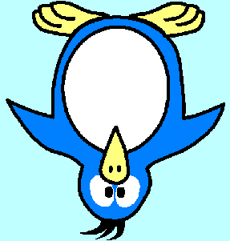
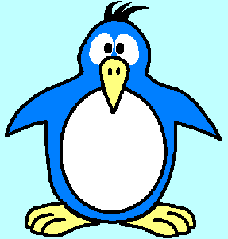
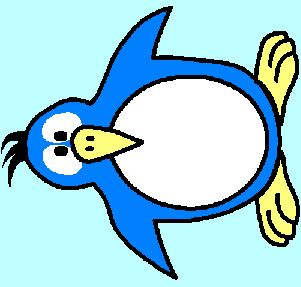

# BMPCPPLIB
Simple and Fast header only Bitmap (BMP) library

## Bitmap Type Supported
- 24 Bits Per Pixel (RGB)

## Examples
<strong>Random Pixel Colors</strong>
<br>
```cpp
#include "BitmapPlusPlus.hpp"
#include <random>
#include <iostream>

static bmp::Pixel random_color() {
  static std::random_device seed{};
  static std::default_random_engine engine{seed()};
  std::uniform_int_distribution<std::int32_t> dist(0, 255);
  bmp::Pixel color{};
  color.r = dist(engine);
  color.g = dist(engine);
  color.b = dist(engine);
  return color;
}

int main(void) {
  try {
    // Create a 512x512 bitmap
    bmp::Bitmap image(512, 512);

    // Assign a random color to each pixel in the image
    for (bmp::Pixel &pixel: image) {
      pixel = random_color();
    }

    // Save bitmap to new file image.bmp
    image.save("image.bmp");

    // And Voila!
    return EXIT_SUCCESS;
  }
  catch (const bmp::Exception &e) {
    std::cerr << "[BMP ERROR]: " << e.what() << std::endl;
    return EXIT_FAILURE;
  }
}
```

<br><br>

<strong>Draw Primitives</strong>

```cpp
#include <iostream>
#include "BitmapPlusPlus.hpp"

using namespace bmp;

int main() {
  // Create a 512x240 blank image
  Bitmap image(512, 240);
  image.clear(Pixel(0x25292e));

  /** Line **/
  // Draw a yellow line from position (250, 50) to position (500, 50)
  image.draw_line(250, 50, 500, 50, Yellow);

  /** Rectangle **/
  // Draw a red rectangle in position (10, 10) with size 100x100
  image.draw_rect(10, 10, 100, 100, Red);
  // Draw a white filled rectangle in position (120, 10) with size 100x100
  image.fill_rect(120, 10, 100, 100, White);

  /** Triangle **/
  image.draw_triangle(60, 120, 10, 220, 120, 220, Cyan);
  image.fill_triangle(180, 120, 130, 220, 245, 220, Magenta);

  /** Circle **/
  // Draw a non-filled Gray circle in position (300, 170) with 50 pixels radius
  image.draw_circle(300, 170, 50, Gray);
  // Draw a filled Lime circle in position (300, 170) with 50 pixels radius
  image.fill_circle(420, 170, 50, Lime);

  // Save bitmap
  image.save("primitives.bmp");

  return EXIT_SUCCESS;
}
```


<br><br>


<strong>Mandelbrot Fractal Set</strong>
<br>
```cpp
#include "BitmapPlusPlus.hpp"
#include "color_maps.inl"
#include <cmath>

int main(void) {
  bmp::Bitmap image(1280, 960);

  double cr, ci;
  double nextr, nexti;
  double prevr, previ;
  constexpr const std::uint16_t max_iterations = 3000;

  for (std::int32_t y = 0; y < image.height(); ++y) {
    for (std::int32_t x = 0; x < image.width(); ++x) {
      cr = 1.5 * (2.0 * x / image.width() - 1.0) - 0.5;
      ci = (2.0 * y / image.height() - 1.0);

      nextr = nexti = 0;
      prevr = previ = 0;

      for (std::uint16_t i = 0; i < max_iterations; ++i) {
        prevr = nextr;
        previ = nexti;

        nextr = prevr * prevr - previ * previ + cr;
        nexti = 2 * prevr * previ + ci;

        if (((nextr * nextr) + (nexti * nexti)) > 4) {
          const double z = sqrt(nextr * nextr + nexti * nexti);

          // https://en.wikipedia.org/wiki/Mandelbrot_set#Continuous_.28smooth.29_coloring
          const std::uint32_t index = static_cast<std::uint32_t>(1000.0 * log2(1.75 + i - log2(log2(z))) /
                                                                 log2(max_iterations));

          image.set(x, y, jet_colormap[index]);

          break;
        }
      }
    }
  }

  image.save("mandelbrot.bmp");

  return EXIT_SUCCESS;
}
```


<br><br>

<strong>Julia Fractal Set</strong>
<br>

```cpp
#include "BitmapPlusPlus.hpp"
#include "color_maps.inl"

int main(void) {
  bmp::Bitmap image(1280, 960);

  constexpr const std::uint16_t max_iterations = 300;

  constexpr const double cr = -0.70000;
  constexpr const double ci = 0.27015;

  double prevr, previ;

  for (std::int32_t y = 0; y < image.height(); ++y) {
    for (std::int32_t x = 0; x < image.width(); ++x) {
      double nextr = 1.5 * (2.0 * x / image.width() - 1.0);
      double nexti = (2.0 * y / image.height() - 1.0);

      for (std::uint16_t i = 0; i < max_iterations; ++i) {
        prevr = nextr;
        previ = nexti;

        nextr = prevr * prevr - previ * previ + cr;
        nexti = 2 * prevr * previ + ci;

        if (((nextr * nextr) + (nexti * nexti)) > 4) {
          const bmp::Pixel color = hsv_colormap[static_cast<std::size_t>((1000.0 * i) / max_iterations)];
          image.set(x, y, color);
          break;
        }
      }
    }
  }

  image.save("julia.bmp");

  return EXIT_SUCCESS;
}
```


<br><br>

<strong>Modify The Penguin</strong>
<br>

```cpp
#include "BitmapPlusPlus.hpp"

int main(void) {
  try {
    bmp::Bitmap image;

    // Load penguin.bmp bitmap
    image.load("penguin.bmp");

    // Modify loaded image (makes half of the image black)
    for (std::int32_t y = 0; y < image.height(); ++y) {
      for (std::int32_t x = 0; x < image.width() / 2; ++x) {
        image.set(x, y, bmp::Black);
      }
    }

    // Save
    image.save("modified-penguin.bmp");

    return EXIT_SUCCESS;
  }
  catch (const bmp::Exception &e) {
    return EXIT_FAILURE;
  }
}
```


<br><br>

<strong>Rotate, Flip The Penguin</strong>
<br>

```cpp
#include "BitmapPlusPlus.hpp"
#include <iostream>
#include <chrono> // For measuring execution time
#include <vector> // For storing timings


int main(void) {
    try {
        bmp::Bitmap image;

        // Load the original bitmap
        image.load("images/penguin.bmp");

        // Test vertical flip
        bmp::Bitmap flipped_v = image.flip_v();
        flipped_v.save("images/rotated/penguin_flipped_v.bmp");
        std::cout << "Vertical flip saved as penguin_flipped_v.bmp" << std::endl;

        // Test horizontal flip
        bmp::Bitmap flipped_h = image.flip_h();
        flipped_h.save("images/rotated/penguin_flipped_h.bmp");
        std::cout << "Horizontal flip saved as penguin_flipped_h.bmp" << std::endl;

        // Test rotate 90 degrees to the right
        bmp::Bitmap rotated_right = image.rotate_90_right();
        rotated_right.save("images/rotated/penguin_rotated_right.bmp");
        std::cout << "Rotated 90 degrees right saved as penguin_rotated_right.bmp" << std::endl;

        // Test rotate 90 degrees to the left
        bmp::Bitmap rotated_left = image.rotate_90_left();
        rotated_left.save("images/rotated/penguin_rotated_left.bmp");
        std::cout << "Rotated 90 degrees left saved as penguin_rotated_left.bmp" << std::endl;

        return EXIT_SUCCESS;
    }
    catch (const bmp::Exception& e) {
        std::cerr << "Error: " << e.what() << std::endl;
        return EXIT_FAILURE;
    }
}


```





<br><br>

<strong>Chess Board</strong>
<br>

```cpp
#include <iostream>
#include "BitmapPlusPlus.hpp"

int main() {
  try {
    // 8x8 chess board
    bmp::Bitmap image(640, 640);
    const std::size_t board_dims = 8;
    const std::size_t rect_w = image.width() / board_dims;
    const std::size_t rect_h = image.height() / board_dims;

    // Iterate over rects
    bool is_white = true;
    for (std::size_t x = 0; x < image.width(); x += rect_w) {
      for (std::size_t y = 0; y < image.height(); y += rect_h) {
        bmp::Pixel color = is_white ? bmp::White : bmp::Black;
        // Fill rect
        image.fill_rect(x, y, rect_w, rect_h, color);
        // Next rect in will be the opposite color
        is_white = !is_white;
      }
      is_white = !is_white;
    }

    // Save bitmap to file
    image.save("chess_board.bmp");

    return EXIT_SUCCESS;
  }
  catch (const bmp::Exception &e) {
    std::cerr << "[BMP ERROR]: " << e.what() << '\n';
    return EXIT_FAILURE;
  }
}
```


<br><br>

<strong>Draw multiple shapes using Polymorphism</strong>
<br>

```cpp
#include <iostream>
#include "BitmapPlusPlus.hpp"

struct Shape {
  int x, y;
  bmp::Pixel color;

  Shape(int x, int y, bmp::Pixel color) : x(x), y(y), color(color) {}

  virtual void draw(bmp::Bitmap &image) = 0;
};

struct Rectangle : Shape {
  int width, height;

  Rectangle(int x, int y, int w, int h, bmp::Pixel color) : width(w), height(h), Shape(x, y, color) {}

  void draw(bmp::Bitmap &image) override {
    image.fill_rect(x, y, width, height, color);
  }
};

struct Triangle : Shape {
  int x2, y2, x3, y3;

  Triangle(int x1, int y1, int x2, int y2, int x3, int y3, bmp::Pixel color) : x2(x2), y2(y2), x3(x3), y3(y3),
                                                                               Shape(x1, y1, color) {}

  void draw(bmp::Bitmap &image) override {
    image.fill_triangle(x, y, x2, y2, x3, y3, color);
  }
};

struct Circle : Shape {
  int radius;

  Circle(int x, int y, int radius, bmp::Pixel color) : radius(radius), Shape(x, y, color) {}

  void draw(bmp::Bitmap &image) override {
    image.fill_circle(x, y, radius, color);
  }
};

int main() {
  try {
    bmp::Bitmap image(640, 256);
    bmp::Pixel background_color{bmp::Silver};
    image.clear(background_color);

    std::vector<Shape *> shapes
      {
        new Rectangle(20, 20, 180, 180, bmp::Pixel(0xa31d3a)),
        new Triangle(310, 20, 230, 200, 400, 200, bmp::Pixel(0x1a5096)),
        new Circle(500, 110, 90, bmp::Pixel(0x228035))
      };

    for (Shape *shape: shapes) {
      shape->draw(image);
      delete shape;
    }
    image.save("shapes.bmp");

    return EXIT_SUCCESS;
  }
  catch (const bmp::Exception &e) {
    std::cerr << "[BMP ERROR]: " << e.what() << '\n';
    return EXIT_FAILURE;
  }
}
```


## Features and bugs
If you face any problems feel free to open an issue at the [issue tracker][tracker]. If you feel the library is missing a feature, please raise a ticket on Github. Pull request are also welcome.

[tracker]: https://github.com/baderouaich/BitmapPlusPlus/issues


